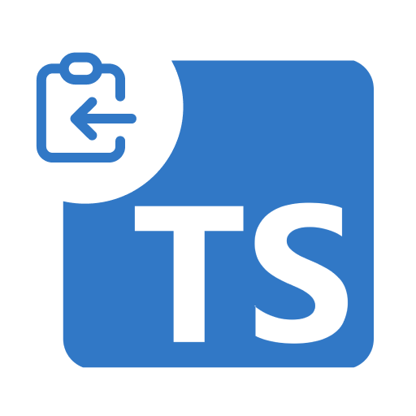

  
 <h2 align="center">Strip TS Copy</h2>
 
VSCode plugin to strip types from TypeScript code while copying it.

  

    
    
  

  
<small>Love the project? Please consider sponsoring to help it improve!</small>

### The Problem

"An underdiscussed benefit of JS over TS - I'll frequently test individual functions by pasting them into the browser console. There's no faster feedback loop. You can't do that with TS. JSDoc TS means extra keystrokes, but overall the ergonomics are waaaay better
" - Rich Harris

> https://twitter.com/Rich_Harris/status/1440639878065111048

### The Solution

strip-ts-copy is a vscode plugin which simply transpiles the selected code and directly puts it inside of your clipboard.

> Inspired by BenLesh: 
> https://twitter.com/BenLesh/status/1441057916413489156

### Usage

1. Install the plugin from [marketplace](https://marketplace.visualstudio.com/items?itemName=anuraghazra.strip-ts-copy)

  
2. Select a piece of code with TS

3. Press <kbd>ctrl+alt+c</kbd> to copy the transpiled code

### TODO

- [ ] Write tests
- [ ] Setup release pipeline